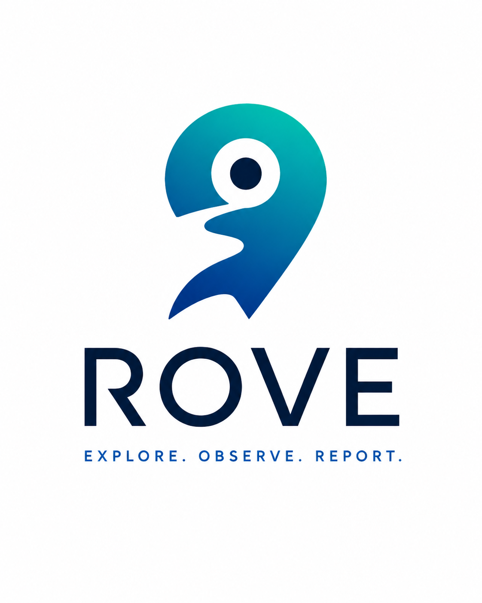

<div align="center">
  

  ### Explore. Observe. Report.

  <sub><i>by Agiterra · early alpha · private repo</i></sub>
</div>

---

## What this is

**Rove** is an agentic UX evaluation platform for the agent-readable web.

It walks your app two ways at once:

- **As real users.** AI personas — a novice, a power user, a mobile field worker, a keyboard-only user — try to accomplish a stated goal. Same flow, different runs, different paths. Non-deterministic by design, because real users are.
- **As agents.** Increasingly the things using web apps aren't people; they're agents (Operator, Claude computer-use, browser-using bots). Rove walks the app as one of these and reports whether the app is **agent-readable**: semantic HTML, accessibility-tree completeness, stable selectors, no hover-only critical actions, no aggressive bot-detection blocking legitimate agentic traffic.

The output isn't pass/fail. It's **findings**: severity-scored UX observations with screenshots, descriptions, and recommended fixes.

## Status

This repo was extracted from the [TankLoop](https://github.com/agiterra/tankloop) monorepo on **2026-05-12** where it lived through Phases 1–11 as `apps/eval-dashboard/`, `apps/tankloop-eval/`, `packages/agentic-ux-evaluator-core/`, and `infra/supabase/eval/`.

It's **early alpha**. The shape of the system works end-to-end (CLI + daemon + dashboard + Supabase + GitHub App + agent walks) — but the surface still says `tankloop-eval` in places, the GitHub App is named "TankLoop Eval Bot," and the persona library is shaped around TankLoop's roles. Rebranding + project-agnostic Phase B is the next milestone.

Plan: see [`nimbalyst-local/plans/rove-extraction-and-standalone-product.md`](https://github.com/agiterra/tankloop/blob/main/nimbalyst-local/plans/rove-extraction-and-standalone-product.md) in tankloop (will migrate here).

## Layout

```
apps/dashboard/        ← Next.js 16 dashboard (formerly apps/eval-dashboard)
packages/cli/          ← CLI + daemon (formerly apps/tankloop-eval; binary "tankloop-eval", to be renamed "rove")
packages/core/         ← Types, schemas, prompts (formerly packages/agentic-ux-evaluator-core)
infra/supabase/        ← Hosted Supabase project migrations
examples/flows/        ← Example flow YAML files
public/brand/          ← Logo, banners, portrait
```

## Build status

This commit is a verbatim copy of the working tankloop sources. Nothing's been renamed yet, so:

- `pnpm install` won't work in isolation — workspace deps still reference `@tankloop/*` packages.
- `vercel deploy` will not find the project link.
- The CLI binary is still called `tankloop-eval`.

Phase B fixes all of that. See the plan.

## Brand

Mark + wordmark designed by Brian Sweet. The cyan→navy gradient is the brand signature.

| | |
| --- | --- |
| Icon (filled) | `public/brand/Rove_Icon.png` |
| Icon (no fill) | `public/brand/Rove_Icon_NoFill.png` |
| Landscape banner | `public/brand/RoveBanner.png` |
| Portrait | `public/brand/RovePortrait.png` |
| "by Agiterra" banner | `public/brand/RoverAgiterraBanner.png` |
| Secondary banner | `public/brand/RoverBanner2.png` |

## License

TBD. Private during alpha.
